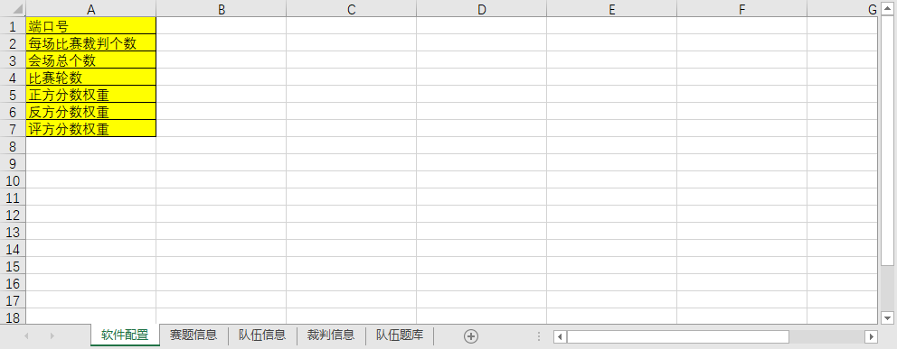
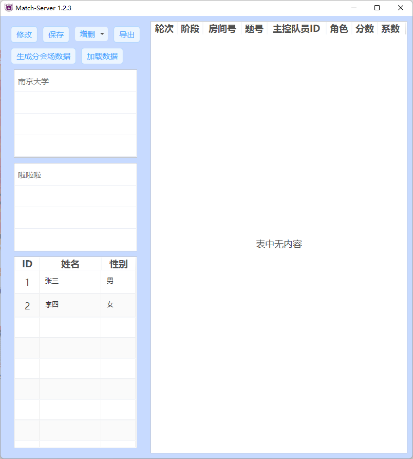
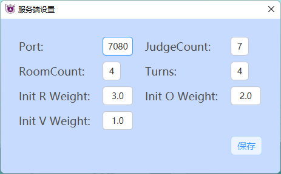

# PTAssist

<p align="center">  


</p>

PTAssist，意为PT比赛小帮手，致力于减轻比赛管理负担和规范化比赛流程。

## 目录

- [特性](#特性)
- [安装](#安装)
- [使用](#使用)
    - [服务端](#服务端)
        1. [配置服务端](#1.-配置服务端)
        2. [打开软件](#2.-打开软件)
        3. [生成对阵表](#3.-生成对阵表)
        4. [生成对阵表](#4.-进入比赛)
        5. [服务端设置](#5.-服务端设置)
        6. [手动修改服务端配置文件](#6.-手动修改服务端配置文件)
    - [客户端](#客户端)
        1. [设置比赛参数](#设置比赛参数)
        2. [下载比赛数据](#下载比赛数据)
        3. [开始比赛](#开始比赛)
- [反馈](#反馈)
- [License](#license)

## 特性

1. 分客户端和服务端两部分，直接通过网络交互数据，
   避免了传统的U盘拷数据的繁琐工作和可能的错误风险
2. 比赛核心进程业务同比赛规则业务分离，能很好的适应各种比赛的规则变化
3. 支持导出比赛进程回顾，减轻比赛运维压力

## 安装

### 运行环境

前往[Java Download | Java 8, Java 11, Java 13 - Linux, Windows & macOS (azul.com)](https://www.azul.com/downloads/?package=jdk)
下载带javafx支持的Java JRE运行环境。

点击左侧的**Zulu**项目下的**Download Now**，跳转至下载界面


在红框所示的筛选器中选择**Java Version**为**Java 17 (LTS)** ，**Operating System**为**Windows**（这里以Windows为例），**Architecture**为**x86
64-bit**（这里以x86 64-bit的主流架构为例），**Java Package**为**JRE FX**


点击下载**.msi**类型的安装包进行安装

### 软件本体

下载`Server-x.y.z.zip`(服务端)或`Client-x.y.z.zip`(客户端)压缩包，解压后双击`bin`目录下的脚本文件即可运行。

## 使用

### 服务端

服务端是比赛承办方所使用的软件，其功能主要为**赛前比赛对阵表的生成**，**赛时比赛信息的收集与规则判断**，和**赛后比赛结果的导出**。
下面，我们将按照比赛流程顺序依次介绍服务端软件的使用。

#### 1. 配置服务端

首先在`bin`目录下运行脚本文件(windows端为`.bat`文件)，此时会初始化软件运行所需的基本环境。接着在`Server/ServerData`文件夹中找到`server_config.xlsx`并打开。此excel表格是用于配置服务端的文件，其中共有**五个**子表，
分别为 **“软件配置”**，**“赛题信息”**，**“队伍信息”**，**“裁判信息”**和**“队伍题库”**。接下来我们将依次介绍它们。

<div align=center></div>

##### 软件配置

端口号：服务端的端口号，将用于网络文件传输，需为大于1024的整数。(Int)

每场比赛裁判个数：一个会场內所需的裁判个数，将主要用于带裁判的比赛对阵表的生成。(Int)

会场总个数：此次比赛所有会场的个数，将主要用于对阵表的生成。(Int)

比赛轮数:所需要生成对阵表的比赛轮数。(Int)

正方/反方/评方分数权重：此次比赛默认的正方/反方/评方初始分数权重。(Double)

##### 赛题信息

用于此次比赛的题号(Int)与题名。

##### 队伍信息

参赛队伍的学校名，队伍名，抽签号(Int)，以及队员名字和性别(填"男"或"女")。
当队伍中有多位队员时，可按照名字，性别这样的顺序在同一行依次填入。
> 注：在没有抽签之前，可不用填写抽签号，在生成没有裁判的对阵表后，请主办方举办队伍抽签，再将抽签号填入，即可生成有裁判的完整对阵表

##### 裁判信息

参赛的学校名称与其学校的裁判。当裁判有多位时，可在同一行依次填入。

##### 队伍题库

为了兼容直接给出各队伍题库而不拒题的比赛规则，这里加入一个队伍题库的表单。若不用该规则，则无需填写该表单，若删除该表单则默认不启用队伍题库规则。
若需要填写题库，注意每个队伍题库的填写规则：各个题目用逗号隔开，逗号半角(,)或全角(，)都可兼容。
以下几种写法均可兼容：

| **描述**      |**举例**|
|---------|----|
| 以半角逗号分割 |1,2,3,4|
| 以全角逗号分割 |1，2，3，4|
|全角半角混杂|1,2，3,4|
|前后也有逗号|,，,,1，2,3，4,，,,|

#### 2. 打开软件

若您的操作系统为windows操作系统，双击`bin`目录下的`Server.bat`启动服务端。

在您启动软件时，软件会先对一些必要文件进行一定检查。
首先是对`ServerCache`中的`config_data.json`缓存文件进行检查。该文件包含了之前介绍的`server_config.xlsx`中的 **“软件配置”** 的信息。
若缓存不存在，那么软件会检查`ServerData/server_config.xlsx`
是否存在。若两者均不存在，则软件将缺乏配置文件而报错，此时将自动生成`server_config.xlsx`并提醒您配置该文件再启动软件。若存在Excel配置文件，
则会对里面的内容进行初审，内容不合规范则会报错，不能成功启动程序。初审通过后则会读取表单内容而生成`config_data.json`缓存文件。
若`ServerCache`中已经存在`config_data.json`缓存文件，那么软件将读取该配置文件，不再读取excel文件中的 **“软件配置”** 表单。

接着，软件会检测比赛的数据文件`ServerData/data.json`是否存在，若不存在同样也会检测`server_config.xlsx`文件的情况。
若文件存在则不会进行任何操作。初审通过后，则进入启动页界面。


<div align=center></div>

#### 3. 生成对阵表

进入服务端软件，进入启动页界面。在配置好`server_data.xlsx`后，点击左下角的 **”生成对阵表(无裁判)“** 按钮即可在
`ServerData`文件夹下生成`counterpartTable.xlsx`的文件，在其表”对阵表(无裁判)“中即可看到对阵表信息。
此时，在`ServerCache`文件夹下也将生成名为`counterpartTable.json`的缓存文件，用于存储对阵表信息。

在`server_data.xlsx`的队伍信息填写好抽签号以后，点击软件左下角的 **”生成对阵表(有裁判)“** 按钮，
软件将读取`counterpartTable.json`缓存文件并在`ServerData`文件夹的`counterpartTable.xlsx`文件
中生成表 **”对阵表“** 与 **”对阵表(含学校名)“**。

> 注：软件生成对阵表时主要考虑尽可能不让同两只队伍在不同轮次中相遇，以及同一支队伍尽量不要多次在不同轮次的第一场作为正方。
> 当会场数小于等于4时效果可能会不是很好，所以当无裁判的对阵表生成后，请务必检查。若有需要修改，则可进入`counterpartTable.json`进行手动修改。
> 具体方法请参见[手动修改服务端配置文件](#6.-手动修改服务端配置文件)。

#### 4. 进入比赛

点击左下角的 **”进入比赛“** 按钮，此时软件将检测`ServerData`文件夹下是否有比赛数据文件`data.json`，
若有则直接读取该文件，若无则将按照`server_data.xlsx`配置文件初始化一个比赛文件。

> 注：当比赛开始后即data.json已经生成，此时无法再通过修改配置文件excel表格来修改任何信息。
> 只能通过修改data.json文件修改配置信息。
> 这一定程度上保证了信息安全，但需要配置服务端时务必再三检查，确认信息无误后再进入比赛。

进入比赛后，软件界面由启动页变为比赛记录界面。

<div align=center></div>


该界面主要由**五部分**组成。左侧从上到下依次是操作栏，学校名称栏，队伍名称栏，队员信息栏。
其中在点击学校名称时，队伍名称栏中会显示出该学校的队伍名称。学校可以配合使用`Ctrl/Command`键或`Shift`键进行多选。
接下来，再点击某个队伍名称时，队员信息栏和右侧的比赛记录栏将对该队伍的信息进行展示。

操作栏中共有**六个按钮**。
第一个是”修改按钮“，它可以开启/关闭对选手信息和队伍记录信息表格的更改。当开启更改后，
界面边框将变成橙色，双击表格中的某个单元格后可以进入编辑模式，输入完后按回车或点击其他地方失去焦点时即完成修改。

第二个是”保存按钮“，
当修改完信息后，按此按钮将内存中的数据保存至文件中。

第三个是”增删按钮“，点击后将下拉出四个选项，分别可以对
选手和记录进行增删。

第四个是”导出按钮“，点击后将弹出导出界面，用于比赛数据统计结果的导出。其最上栏可选择导出的轮数，
可多选。下侧可选择导出表格的类型，分别为“各轮回顾表”，“各队伍总得分”和“个人得分情况”表，可多选。最下面是
确定导出的按钮，点击后，将根据所选项在`ServerData`中生成`第x轮成绩.xlsx`文件，这三种不同的表在不同的表单(sheet)中展示。

第五个是“生成分会场数据”按钮，点击后将弹出对话框，选择下一轮比赛的轮数，
选择轮数后将在`ServerData/match`文件夹中按照轮数生成各个会场所需的文件，文件将以会场号命名。
该文件将用于各个分会场下一轮比赛时确定可选题目、主控队员等。客户端设置"Online"模式下，
当分会场点击下载数据时，将从这个文件夹内根据轮数和会场号获取数据文件。

第六个是“加载数据”按钮，点击后将弹出文件选择框，选择的`.json`文件中的数据将与目前内存中的数据进行合并。
客户端设置"Online"模式下，分会场数据将通过网络默认上传到`ServerData/.tmp`文件夹内。为了操作时不容易出错，
此文件夹内被选择的文件将会在被加载后删除，并备份到`ServerData/backup`文件夹内；其他文件夹内的数据则只会备份，不会删除。


> 注：修改模式下不可修改学校名和队伍名，若需要修改，请参见[手动修改服务端配置文件](#6.-手动修改服务端配置文件)。为防止误操作，任何对数据的修改(包括“加载数据”)都需要点击保存按钮才能保存至本地文件内，
> 服务端操作人员在进行改动后一定要记得及时保存！
>

#### 5. 服务端设置

在成功进入启动页后，`ServerCache`文件夹中应该已经生成从excel表格读取生成的`config_data.json`文件。
此时按下启动页的设置按钮，则可读取该缓存文件，并进入修改界面。 若`ServerCache`中并没有缓存文件，则会读取excel中的 **“软件配置”** 表单
生成缓存文件。

<div align=center></div>

#### 6. 手动修改服务端配置文件

有些情况下，比如软件本身并没有提供修改数据的接口，或者对阵表数据不尽如意，就需要直接手动修改原始`.json`文件。

##### 第一类：data.json文件

`data.json`是数据库文件，其中保存了队伍信息(包括选手和该队伍的比赛记录信息)，赛题信息和学校信息。

其中，队伍信息是可以在服务端软件中直接修改的，非常不建议直接手动修改`.json`文件，这里不做介绍。

赛题信息保存在名为"questionMap"的容器中，可以看到，赛题的保存方式即为`"赛题id":"赛题名称"`，
如`"1":"你来发明"`，除了最后一项，其他项都需要在每一项的最后加上半角逗号。在这里，你可以增加/删除/修改赛题信息。

学校信息保存在名为"schoolMap"的容器中，可以看到，赛题的保存方式即为`"学校id":"学校名称"`，
如`"1":"南京大学"`，除了最后一项，其他项都需要在每一项的最后加上半角逗号。在这里，你可以增加/删除/修改学校信息。

根据默认`server_config.xlsx`文件生成的数据库文件如下所示：

```json
{
  "teamDataList": [
    {
      "id": 1,
      "name": "啦啦啦",
      "schoolID": 1,
      "playerDataList": [
        {
          "id": 1,
          "name": "张三",
          "gender": "男"
        },
        {
          "id": 2,
          "name": "李四",
          "gender": "女"
        }
      ]
    }
  ],
  "questionMap": {
    "1": "你来发明"
  },
  "schoolMap": {
    "1": "南京大学"
  }
}
```

##### 第二类：counterPartTable.json文件

`counterPartTable.json`保存无裁判的对阵表信息。其中"teamTableList"保存了经过一定随机打乱后实际使用的对阵表，
也是之后有裁判对阵表生成的来源。
"teamTableListWithoutShuffle"保存了没有打乱过，只是经过一定平移的对阵表。
若需要改变对阵表，只需要更改前者。

这两个容器的数据结构是一样的，在最外的一对中括号[ ]中，保存了n轮的对阵表信息，每一轮数据用一对花括号{ }保存。
其中的RList/OList/VList/OBList是这一轮正方/反方/评方/观摩方的队伍id列表。一个List中分别是不同会场的队伍id。
若无观摩方，则显示为-1。

这里以会场数为三，总队伍数为十为例：

```json
{
  "teamTableList": [
    {
      "roomCount": 3,
      "totalTeamNumber": 10,
      "RList": [
        1,
        2,
        3
      ],
      "OList": [
        4,
        5,
        6
      ],
      "VList": [
        7,
        8,
        9
      ],
      "OBList": [
        10,
        -1,
        -1
      ]
    },
    {
      "roomCount": 3,
      "totalTeamNumber": 10,
      "RList": [
        6,
        5,
        4
      ],
      "OList": [
        8,
        7,
        9
      ],
      "VList": [
        10,
        3,
        2
      ],
      "OBList": [
        1,
        -1,
        -1
      ]
    }
  ],
  "teamTableListWithoutShuffle": [
    {
      "roomCount": 3,
      "totalTeamNumber": 10,
      "RList": [
        1,
        2,
        3
      ],
      "OList": [
        4,
        5,
        6
      ],
      "VList": [
        7,
        8,
        9
      ],
      "OBList": [
        10,
        -1,
        -1
      ]
    },
    {
      "roomCount": 3,
      "totalTeamNumber": 10,
      "RList": [
        1,
        2,
        3
      ],
      "OList": [
        6,
        4,
        5
      ],
      "VList": [
        8,
        9,
        7
      ],
      "OBList": [
        10,
        -1,
        -1
      ]
    }
  ]
}
```

### 客户端

解压缩`Client-x.y.z.zip`，运行**bin**目录下的`Client.bat`即可启动软件


#### 设置比赛参数

第一使用时需要先点击设置按钮，配置服务器ip，端口等重要参数

**参数说明如下**

| 配置项    | 含义               |
|--------|------------------|
| IP     | 服务器IP            |
| 端口     | 服务器端口号           |
| 会场编号   | 志愿者所在的比赛会场的编号    |
| 轮次     | 当前比赛的轮次          |
| 裁判数    | 当前比赛的裁判数量        |
| 本轮比赛类型 | 指当前轮次比赛是不是自选题轮次  |
| 规则     | 当前比赛所用的规则库       |
| 工作模式   | 软件的工作模式，分离线和在线两种 |

**P.S.**
> 每轮比赛开始前，务必确认比赛轮次正确，否则可能会下载错比赛数据

#### 下载比赛数据

点击下载比赛数据，等待跳出数据下载完毕的提示框即可

建议同步注意控制台信息，有可能因为网络问题导致下载失败

**P.S.**
> 只有在服务端管理人员**确认对局数据生成完毕**之后，才能正确下载比赛数据

#### 开始比赛

点击开始比赛按钮即可开始进入比赛流程（这里用空载状态演示软件布局）

软件左侧为可选赛题选择区，右侧分四个部分，分别为赛题操作区、主控队员选择区、评委评分区、比赛流程控制区。

**P.S.**
> 对于因主控次数超额等原因无法上场主控的队员，队员选择下拉框中将**不会出现其姓名**
>
> 点击`确定`按钮即视为已确认当前对局比赛信息无误，开始提交比赛分数，后续无法修改
> （注意未选填完队员信息或未确认选题的情况下，软件会自动阻止确认行为）
>
> 在**未确认**时，关闭软件会丢失当前阶段的对局信息，不会丢失整局比赛信息，只需重填当前对局情况即可

## 反馈

- 请在志愿者群或者技术支援群中反馈出现的问题，所作的操作，并附上截图（反馈参考模板如下）

```text
问题：（填写出现的问题的描述）
操作：（填写出现问题前所作的操作）
时间：（填写出现问题时的时间）

（随后附上截图，推荐附上能较好描述问题的软件截图和控制台信息截图）
```

- 如有必要，请附上对应的日志文件（文件在bin目录的log目录下）

## LICENSE

Copyright (C) 2022  [Eur3ka](https://github.com/VatinaCharo),[EnjoyXu](https://github.com/EnjoyXu)

This program is free software: you can redistribute it and/or modify
it under the terms of the GNU Affero General Public License as published
by the Free Software Foundation, either version 3 of the License, or
(at your option) any later version.

This program is distributed in the hope that it will be useful,
but WITHOUT ANY WARRANTY; without even the implied warranty of
MERCHANTABILITY or FITNESS FOR A PARTICULAR PURPOSE. See the
GNU Affero General Public License for more details.

You should have received a copy of the GNU Affero General Public License
along with this program. If not, see <https://www.gnu.org/licenses/>.