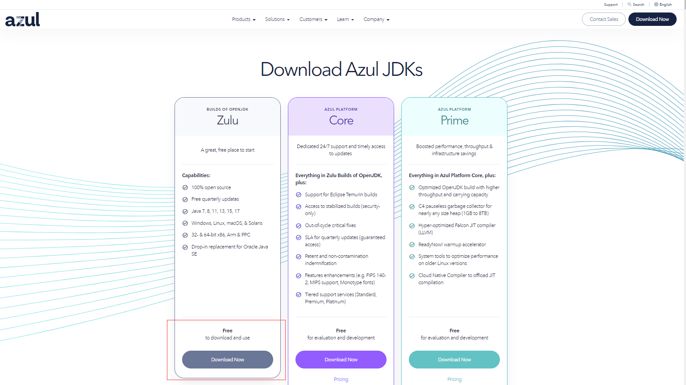
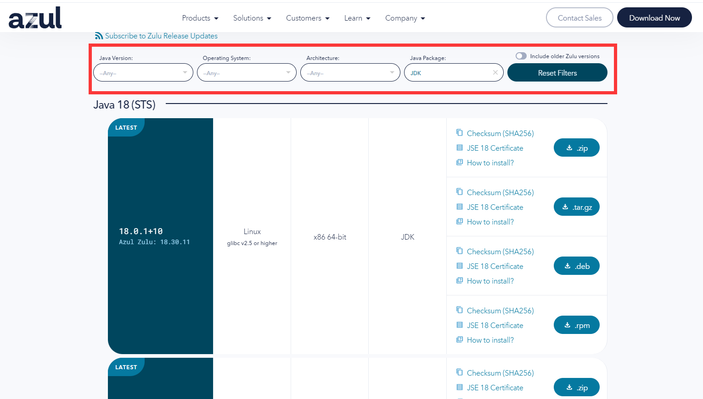
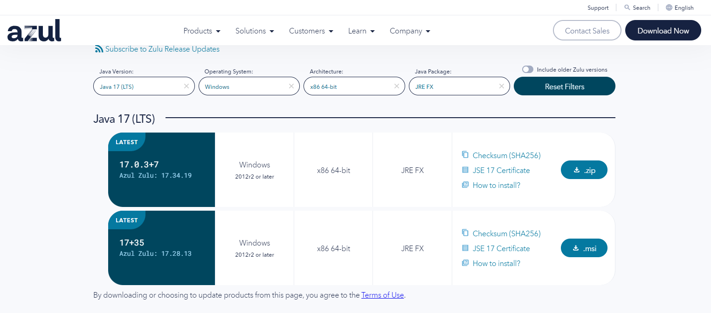
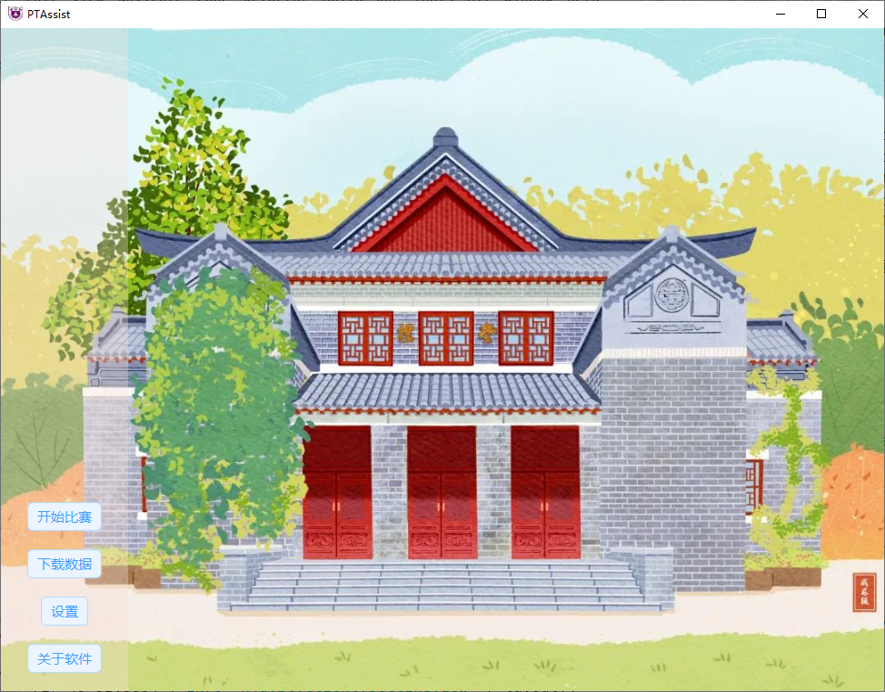
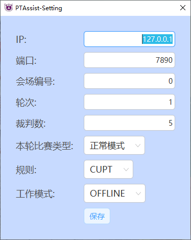
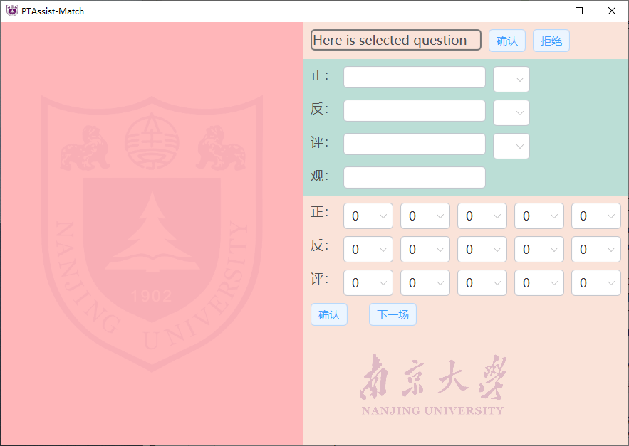

# PTAssist-Client

<p align="center">  


</p>

PTAssist，意为PT比赛小帮手，致力于减轻比赛管理负担和规范化比赛流程。

## 目录

- [特性](#特性)
- [安装](#安装)
- [使用](#使用)
    1. [设置比赛参数](#设置比赛参数)
    2. [下载比赛数据](#下载比赛数据)
    3. [开始比赛](#开始比赛)
- [反馈](#反馈)
- [License](#license)

## 特性

1. 分客户端和服务端两部分，直接通过网络交互数据，
   避免了传统的U盘拷数据的繁琐工作和可能的错误风险
2. 比赛核心进程业务同比赛规则业务分离，能很好的适应各种比赛的规则变化
3. 支持导出比赛进程回顾，减轻比赛运维压力

## 安装

### 运行环境

前往[Java Download | Java 8, Java 11, Java 13 - Linux, Windows & macOS (azul.com)](https://www.azul.com/downloads/?package=jdk)
下载带javafx支持的Java JRE运行环境。

点击左侧的**Zulu**项目下的**Download Now**，跳转至下载界面

<div align=center></div>

<div align=center></div>

在红框所示的筛选器中选择**Java Version**为**Java 17 (LTS)** ，**Operating System**为**Windows**（这里以Windows为例），**Architecture**为**x86
64-bit**（这里以x86 64-bit的主流架构为例），**Java Package**为**JRE FX**

<div align=center></div>


点击下载**.msi**类型的安装包进行安装

### 软件本体

下载`Client-x.y.z.zip`(服务端)或`Client-x.y.z.zip`(客户端)压缩包，解压后双击`bin`目录下的脚本文件即可运行。


## 使用

解压缩`Client-x.y.z.zip`，运行`bin`目录下的`Client.bat`即可启动软件

<div align=center></div>

### 设置比赛参数

第一使用时需要先点击设置按钮，配置服务器ip，端口等重要参数

<div align=center></div>

**参数说明如下**

| 配置项    | 含义               |
|--------|------------------|
| IP     | 服务器IP            |
| 端口     | 服务器端口号           |
| 会场编号   | 志愿者所在的比赛会场的编号    |
| 轮次     | 当前比赛的轮次          |
| 裁判数    | 当前比赛的裁判数量        |
| 本轮比赛类型 | 指当前轮次比赛是不是自选题轮次  |
| 规则     | 当前比赛所用的规则库       |
| 工作模式   | 软件的工作模式，分离线和在线两种 |


>注： 每轮比赛开始前，务必确认比赛轮次正确，否则可能会下载错比赛数据

### 下载比赛数据

点击下载比赛数据，等待跳出数据下载完毕的提示框即可

建议同步注意控制台信息，有可能因为网络问题导致下载失败


>注： 只有在服务端管理人员**确认对局数据生成完毕**之后，才能正确下载比赛数据

### 开始比赛

点击开始比赛按钮即可开始进入比赛流程（这里用空载状态演示软件布局）

<div align=center></div>

软件左侧为可选赛题选择区，右侧分四个部分，分别为赛题操作区、主控队员选择区、评委评分区、比赛流程控制区。


> 注：对于因主控次数超额等原因无法上场主控的队员，队员选择下拉框中将**不会出现其姓名**
>
> 点击`确定`按钮即视为已确认当前对局比赛信息无误，开始提交比赛分数，后续无法修改
> （注意未选填完队员信息或未确认选题的情况下，软件会自动阻止确认行为）
>
> 在**未确认**时，关闭软件会丢失当前阶段的对局信息，不会丢失整局比赛信息，只需重填当前对局情况即可

## 反馈

- 请在志愿者群或者技术支援群中反馈出现的问题，所作的操作，并附上截图（反馈参考模板如下）

```text
问题：（填写出现的问题的描述）
操作：（填写出现问题前所作的操作）
时间：（填写出现问题时的时间）

（随后附上截图，推荐附上能较好描述问题的软件截图和控制台信息截图）
```

- 如有必要，请附上对应的日志文件（文件在bin目录的log目录下）

## LICENSE

Copyright (C) 2022  [Eur3ka](https://github.com/VatinaCharo),[EnjoyXu](https://github.com/EnjoyXu)

This program is free software: you can redistribute it and/or modify
it under the terms of the GNU Affero General Public License as published
by the Free Software Foundation, either version 3 of the License, or
(at your option) any later version.

This program is distributed in the hope that it will be useful,
but WITHOUT ANY WARRANTY; without even the implied warranty of
MERCHANTABILITY or FITNESS FOR A PARTICULAR PURPOSE. See the
GNU Affero General Public License for more details.

You should have received a copy of the GNU Affero General Public License
along with this program. If not, see <https://www.gnu.org/licenses/>.